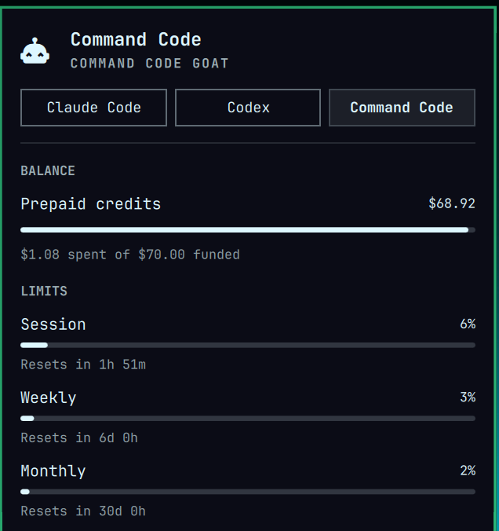

# omarchy-commandcode

Keep an eye on your **Command Code** subscription without leaving the bar: the
5-hour, weekly and monthly spend windows, the reset countdowns, your plan and
your remaining prepaid credits, all as a native tab in the Omarchy agents
panel.



No extra tooling, no API key to paste, no background daemon. The plugin reads
the credential your Command Code CLI already stored, asks Command Code's own
billing API for your usage, and writes one record the panel picks up.

## What you get

- **Session (5h) and Weekly meters** — dollars spent against each rolling cap,
  with live "resets in" countdowns.
- **Monthly allowance** — the plan's credit pool drawn down for the billing
  period, resetting at your next renewal.
- **Prepaid credits balance** — remaining of funded, updated automatically.
- **Plan-aware** — knows GOAT, Pro, Go, Max, Ultra and Teams tiers, and shows
  the matching label.

## Requirements

- Omarchy, with the `omarchy.agents` bar widget in your layout.
- A signed-in Command Code CLI — the same login the `commandcode` CLI uses.
- `python3` (already present on Omarchy).

## Install

```bash
omarchy plugin add https://github.com/fsavoia/omarchy-commandcode.git --enable
```

That is the whole setup. Sign in to Command Code once with the official CLI and
the tab appears; if you are not signed in, the plugin writes nothing and the
panel simply shows no Command Code tab.

## Authentication

Credentials are **reused, never issued, and only ever read**. The plugin looks,
in order, at:

1. `COMMANDCODE_API_KEY` in the environment, if set;
2. `~/.commandcode/auth.json` (the official CLI's own file);
3. `~/.pi/agent/auth.json` under the `command-code` / `commandcode` key.

It never refreshes a token or writes a file back — that belongs to the CLI that
owns the credential. An expired token is reported as such instead of being
silently overwritten.

## How it works

- `bin/commandcode-collect` calls Command Code's billing API over HTTPS with
  your bearer token:
  - `GET /alpha/whoami` — account/org scope,
  - `GET /alpha/billing/credits` — the five-hour and weekly spend windows plus
    the credit ledger,
  - `GET /alpha/billing/subscriptions` — the plan and billing period end.
- It maps that into the agents-panel record format (`limits[]` from the
  windows, `balance` from the ledger) and writes
  `~/.local/state/omarchy/agents/usage/commandcode.json` atomically.
- `ui/main.qml` runs the collector every 5 minutes and at startup.
- Nothing outside `~/.local/state/omarchy/agents/usage/` is touched.

## Conflicts

`dell.commandcode-usage` writes the same `commandcode.json` from local session
stats. Run one or the other: this plugin owns the quota and credits, that one
owns the local token charts. Remove it with
`omarchy plugin remove dell.commandcode-usage`.

## Manual test

```bash
~/.config/omarchy/plugins/fsavoia.commandcode-usage/bin/commandcode-collect          # print the record
~/.config/omarchy/plugins/fsavoia.commandcode-usage/bin/commandcode-collect --write
jq . ~/.local/state/omarchy/agents/usage/commandcode.json
omarchy plugin validate ~/.config/omarchy/plugins/fsavoia.commandcode-usage
omarchy-shell shell rescanPlugins
```

## Uninstall

```bash
omarchy plugin remove fsavoia.commandcode-usage
rm ~/.local/state/omarchy/agents/usage/commandcode.json
```

Removing the plugin stops the collector; deleting the record drops the tab.

## License

MIT
